#Expenses controll
###This app is basically REST API that manages CRUD operations with database data on server
---
##Begining
To start this app you need:
1. MySql
2. Node.js
---
##Setup
1. Import the SQL file named __"expenses-db"__ into any of MySql DBMS (like __phpMyAdmin__)
2. Make sure your db requisities are set to default (__user:root__, __password:root__, __port:3306__, __host:localhost__). If not, go to config/config.json and make appropriate changes
3. To set up the app perform a commands from app directory via command line:
```
npm init
npm run dev
```
enter "Ctrl+C" to stop server.

4. If you want to run app tests perform next commands to make developers dependencies:
```
npm i --save-dev jest supertest
```
and after that use
```
npm run test
```


5. To test how it works use [postman](https://www.postman.com/) on __localhost:5000__ or __127.0.0.1:5000__

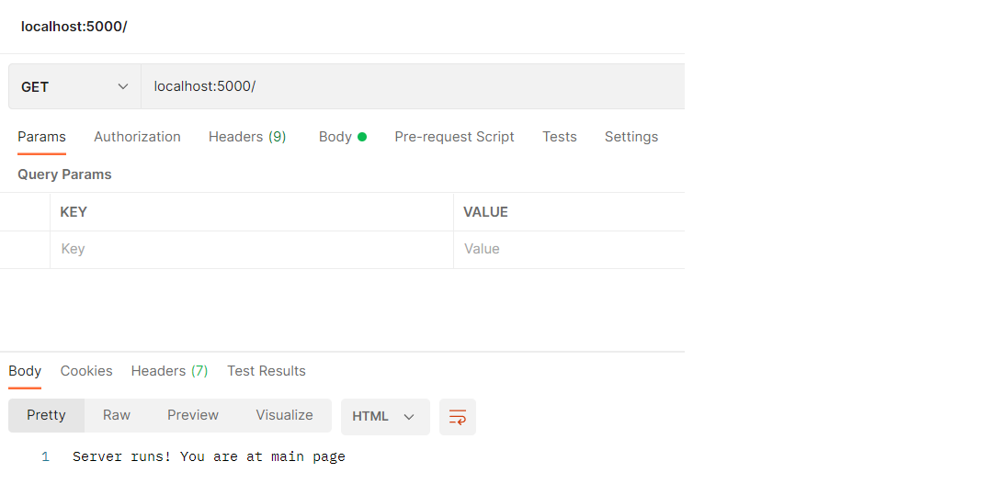

use GET request to get all users in JSON format
>localhost:5000/user

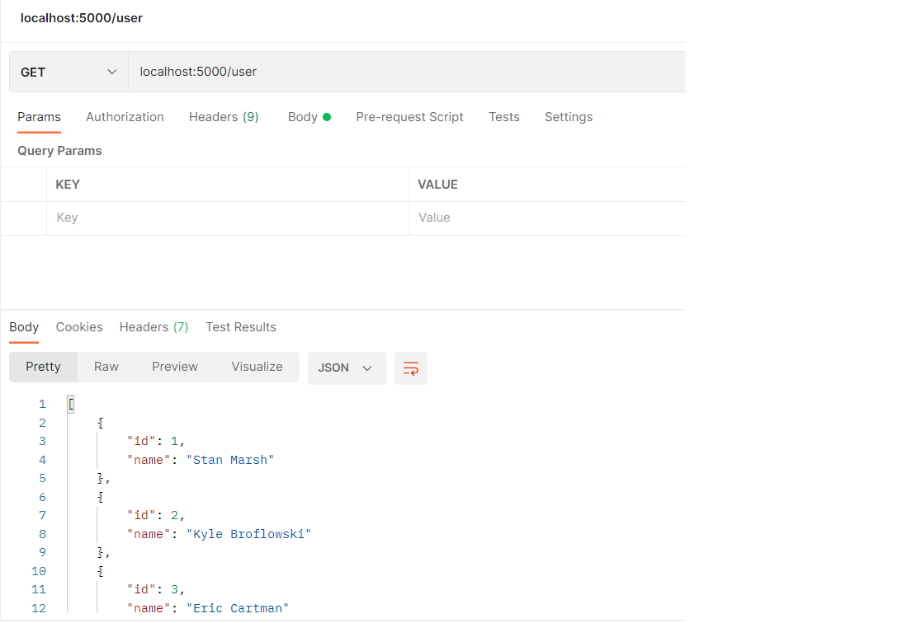

use GET request to get all expenses in JSON format
>localhost:5000/expenses

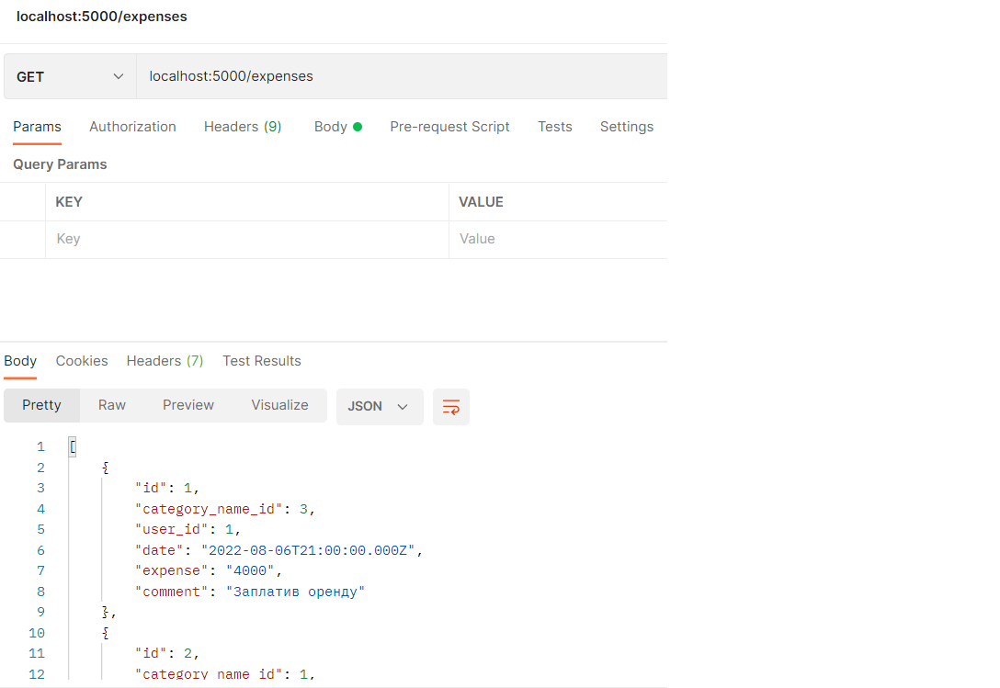

use GET request to get all expense categories in JSON format
>localhost:5000/categories

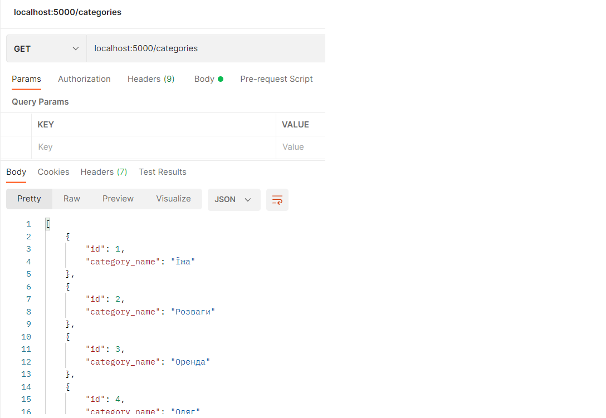

---
###To get expenses by category use GET
>localhost:5000/expenses/byCategory/{category_id}

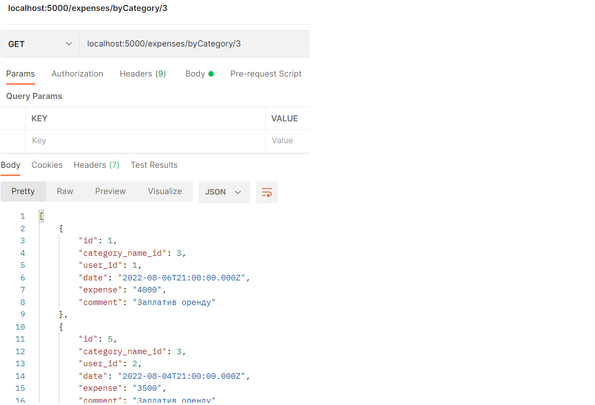

###To get expenses by date use POST
>localhost:5000/expenses/byDate

and set date in request body in raw json format

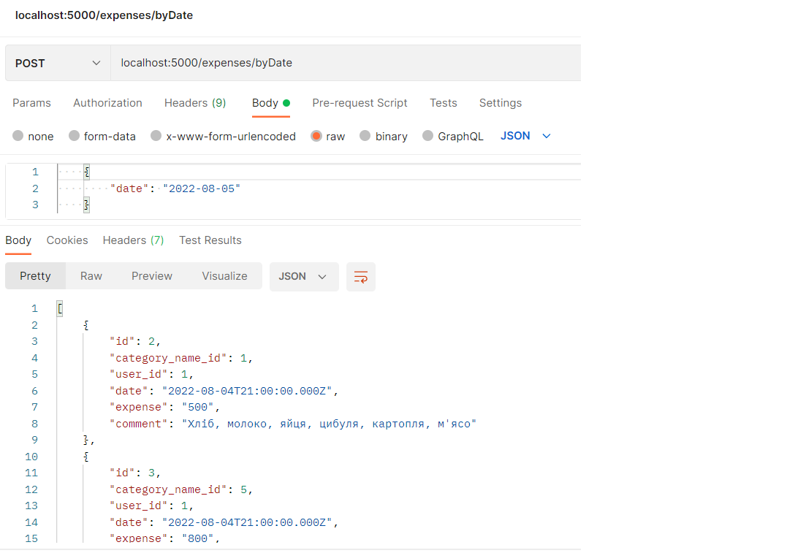

###To get expenses by month use POST
>localhost:5000/expenses/byMonth

and set date in request body in raw json format

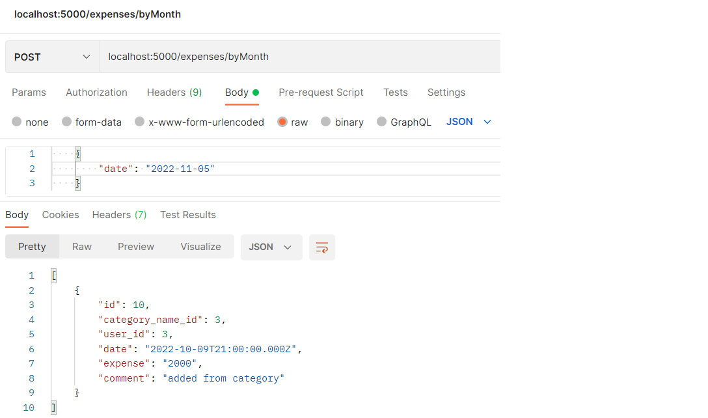

###To get expenses by year use POST
>localhost:5000/expenses/byYear

and set date in request body in raw json format

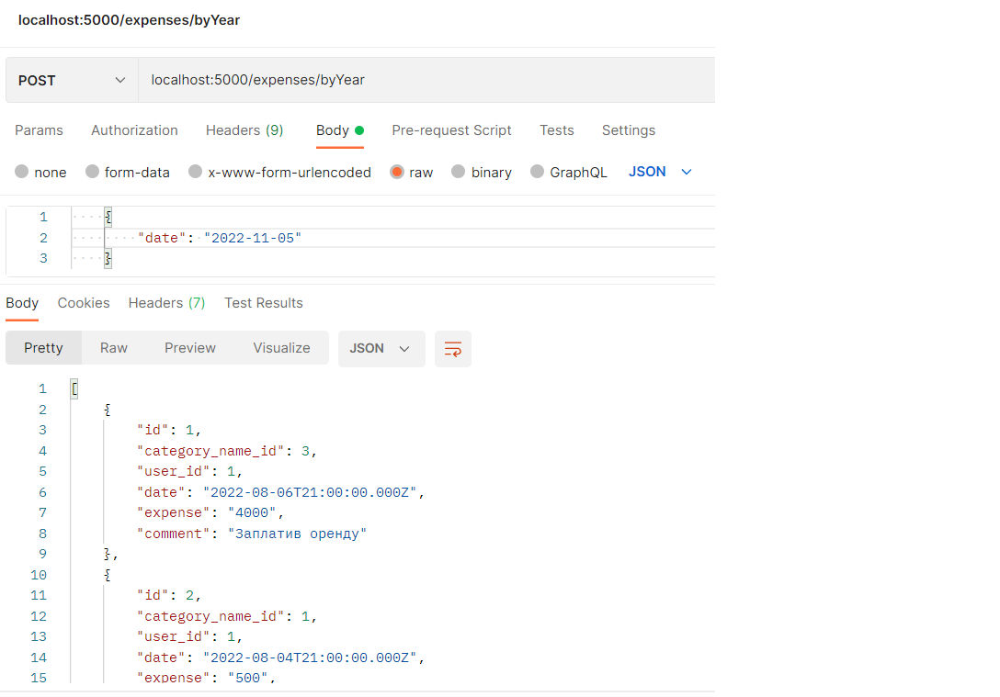

###To add expenses by category use POST
>localhost:5000/expenses/byCategory/{category_id}

and set all data fields in request body in raw json format

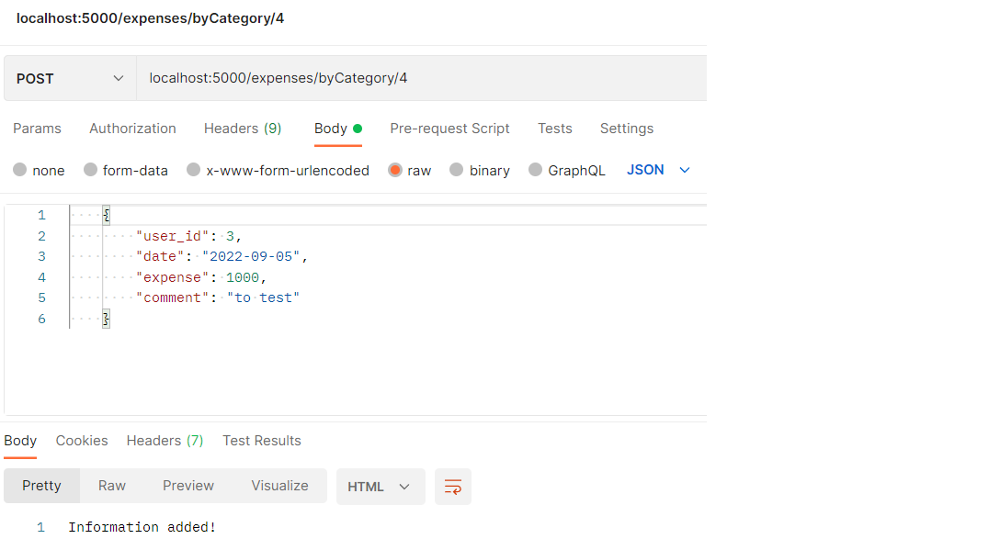

---

###To get expenses of selected user use GET
>localhost:5000/user/{id}

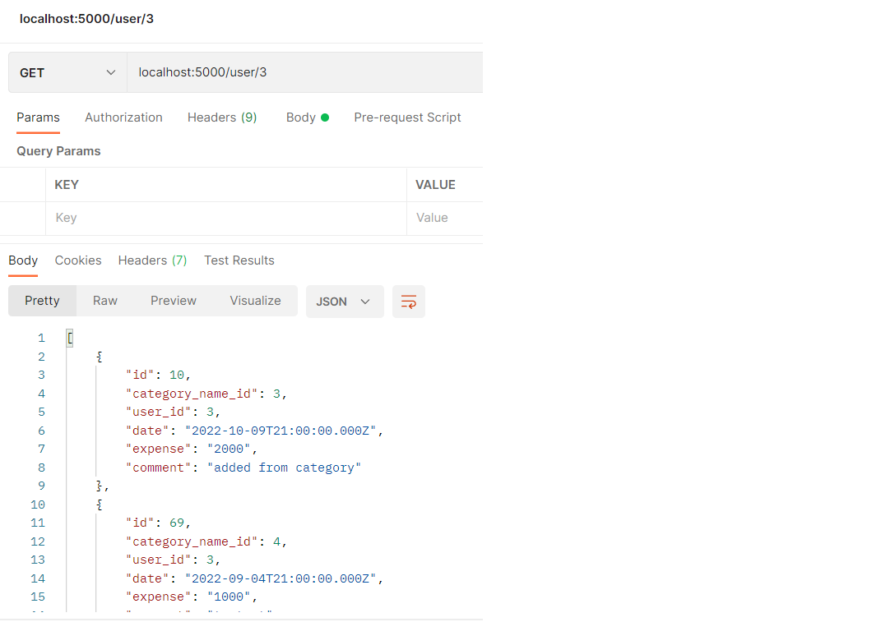

###To add an expense of selected user use POST
>localhost:5000/user/{id}

and set all data fields in request body in raw json format

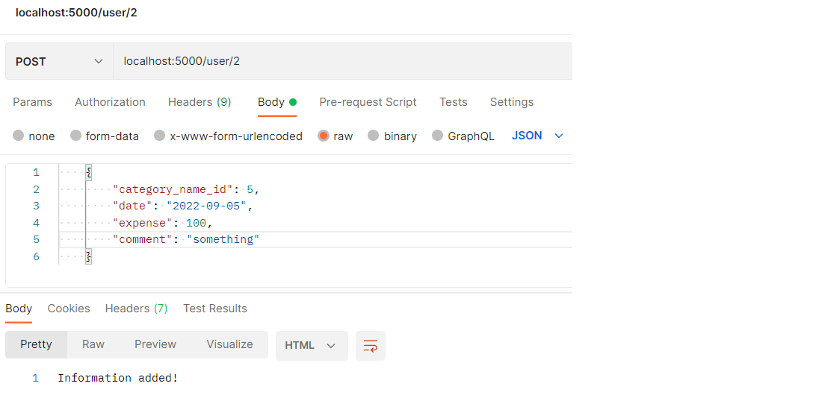

###To delete all expenses of the selected user use DELETE
>localhost:5000/user/{id}

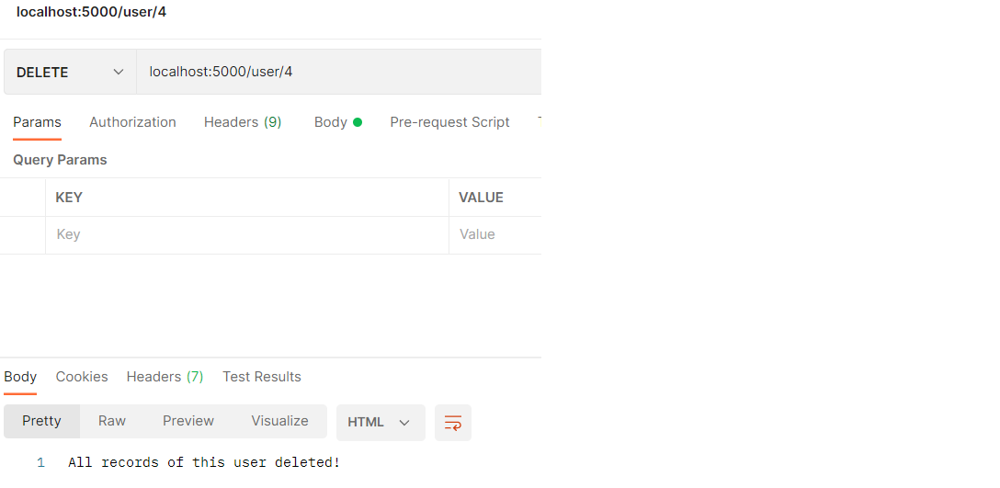

###To get all users expenses by date use POST
>localhost:5000/user/{id}/by_date

and set date in request body in raw json format

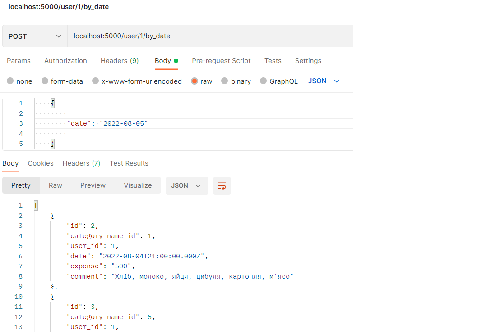